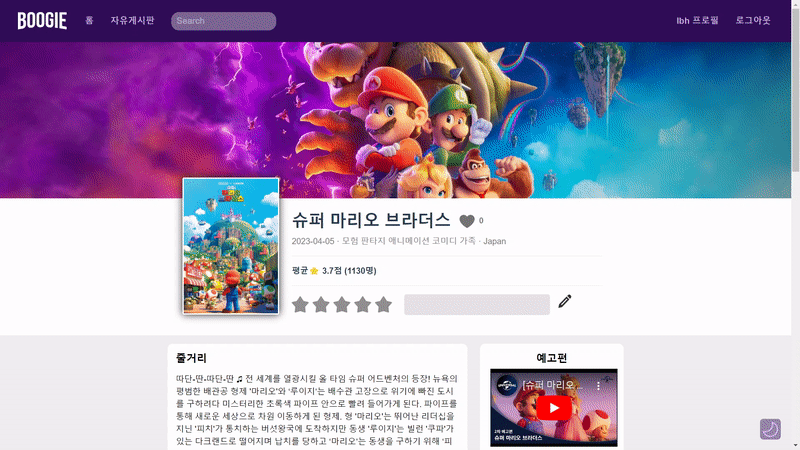
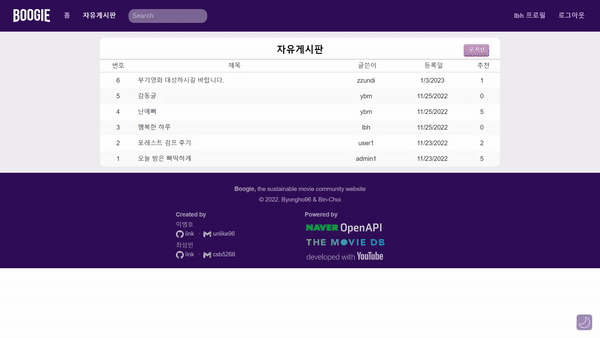
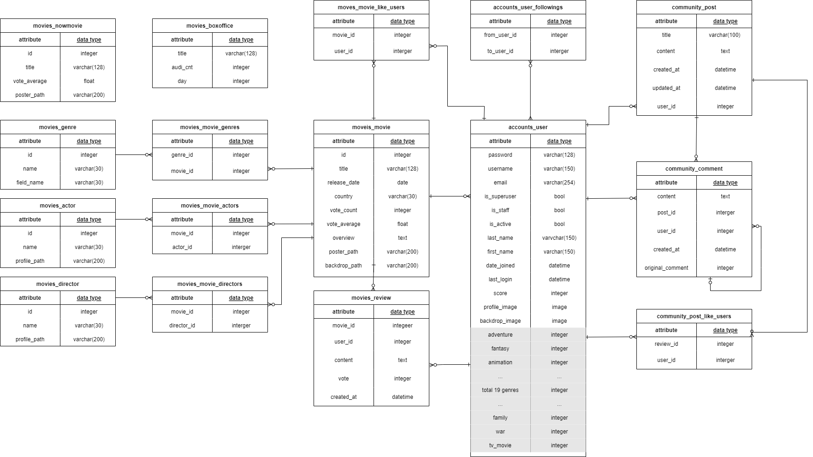

<a href="https://boogie-movie.site">
  
</a>

## Index <!-- omit in toc -->

- [1. 개요](#1-개요)
- [2. 대표 기능](#2-대표-기능)
  - [2.1. 실시간 웹사이트](#21-실시간-웹사이트)
  - [2.2. 영화 추천](#22-영화-추천)
  - [2.3. 데이터베이스 확장](#23-데이터베이스-확장)
  - [2.4. 사용자 상호작용](#24-사용자-상호작용)
- [3. 화면 예시](#3-화면-예시)
  - [3.1. 메인 화면](#31-메인-화면)
  - [3.2. 영화 상세 화면](#32-영화-상세-화면)
  - [3.3. 커뮤니티 화면](#33-커뮤니티-화면)
  - [3.4. 프로필 화면](#34-프로필-화면)
- [4. 배포](#4-배포)
- [5. 성능 개선 사항](#5-성능-개선-사항)
  - [5.1. Django ORM](#51-django-orm)
  - [5.2. Redis](#52-redis)
- [6. 기타](#6-기타)
  - [6.1. ERD](#61-erd)
  - [6.2. 프로젝트 회고](#62-프로젝트-회고)

# 1. 개요

Boogie 프로젝트는 8주 동안 학습한 Vue와 Django를 바탕으로 **영화 커뮤니티 웹사이트**를 제작하는 것을 목표했습니다. 개인 측면에서는, 다음의 FE와 BE의 핵심 기능을 직접 구현함으로써, 웹 서비스의 각 파트에 대한 기본적인 이해도를 쌓는 것을 목표했습니다.

- **Django**
  - Django REST framework를 활용한 RESTful API 생성
  - Django ORM을 이용한 데이터베이스 관리
- **Vue**
  - axios를 이용한 AJAX 데이터 요청
  - Vue Lifecycle Hook을 활용한 데이터 관리
  - Vuex를 활용한 전역 상태 관리
  - 반응형 웹페이지 제작

# 2. 대표 기능

## 2.1. 실시간 웹사이트

Boogie 웹사이트는 리눅스의 **Crontab** 서비스를 이용해 일정 주기마다 **스스로 데이터베이스**를 업데이트 합니다.

- 메인페이지의 현재 상영영화 매일 업데이트
- 메인페이지의 지난주 TOP5 일별 관객수 매주 업데이트

```python
# settings.py
INSTALLED_APPS = [
    ...
    'django_crontab',
    ]

CRONJOBS = [
    # 매일 자정 상영영화 TMDB API 요청으로 DB 업데이트
    ('* 0 * * *', 'movies.views.fill_movie_now_every_day', '>> schedule.log'),
    # 매주 월요일 지난주 일별 관객수 영화진흥회 API 요청으로 DB 업데이트
    ('* 1 * * 1', 'movies.views.ill_boxoffice_every_week', '>> schedule.log')
]
```

## 2.2. 영화 추천

Boogie 웹사이트는 사용자의 좋아요 선택과 별점을 추적하여, 사용자가 **선호하는 장르의 영화를 추천**합니다. 유저의 장르 선호도를 계산하는 기준은 다음과 같습니다.

- 영화를 찜한 경우, 해당 영화의 장르에 대해서 +1
- 영화에 별점 기반 리뷰를 경우, 해당 영화의 장르에 대해서 +(5점 만점 별점 - 3)

추천 영화는 서버측의 다음 API controller에 의해서 계산되어 반환됩니다.

```python
# movies/views.py

@api_view(['GET'])
@permission_classes([IsAuthenticated])
def movie_list_recommend(request):
    # 유저의 장르 선호도 가져오기
    user = get_user_model().objects.get(pk=request.user.pk)
    genre_preference = UserPreferenceSerializer(user).data

    # 모든 영화를 장르 리스트 포함해서 가져오기
    serializer = MovieListGenreSerializer(Movie.objects.all(), many=True)
    movies = serializer.data

    id_to_field_name = {12:	'adventure', 14: 'fantasy', 16:	'animation', 18	: 'drama', 27: 'horror', 28: 'action', 35: 'comedy', 36: 'history', 37:	'western', 53: 'thriller', 80: 'crime', 99: 'documentary', 878: 'science_fiction', 9648	: 'mystery', 10402: 'music', 10749: 'romance', 10751: 'family', 10752: 'war', 10770: 'tv_movie',}

    # 사용자의 장르 선호도에 따라 영화에 점수를 부여하는 함수
    def calculate_score(movie):
        score = 0
        genres = movie['genres']
        for genre in genres:
            field_name = id_to_field_name[genre]
            score += genre_preference[field_name]
        return score

    # 사용자의 장르 선호도에 따라 영화 데이터 정렬
    movies.sort(key= lambda x: calculate_score(x), reverse=True)

    # 상위 3개의 영화 반환
    return Response(movies[:10])
```

## 2.3. 데이터베이스 확장

Boogie 웹사이트는 사용자가 요청한 영화가 자체 데이터베이스에 없을 경우, TMDB API를 이용해 해당 영화의 상세 정보를 요청하고, 그 결과를 자체 데이터베이스에 저장합니다.

배포일 시 기준 Boogie 웹사이트의 데이터베이스는 약 200여 개의 영화 만을 가지고 있지만, 그와 무관하게 Boogie 웹사이트는 사용자가 요청하는 모든 영화에 대한 정보를 제공하고, 그에 따라 자체 데이터베이스도 스스로 확장해나갑니다.

```python
def save_movie(id):
    # 이미 영화가 데이터베이스에 존재하는 경우
    try:
        Movie.objects.get(id=id)
        return

    # 영화가 데이터베이스에 존재하지 않는 경우, TMDB에 API 요청 후 DB 확장
    except:
        m = Movie()

        url_detail = f'https://api.themoviedb.org/3/movie/{id}?api_key={TMDB_API_KEY}&language=ko-KO'
        response = requests.get(url_detail)
        movie_detail = response.json()
        # 이하는 요청한 정보를 DB에 저장하는 로직
        ...
```

## 2.4. 사용자 상호작용

Boogie 웹사이트는 사용자로부터 다양한 상호작용을 받을 수 있도록 설계했습니다.

- 미디어 파일(프로필 이미지) 업로드
- ckeditor 라이브러리를 활용한 html 기반 문서 업로드
- 게시판 댓글/대댓글 기능
- 영화 좋아요 기능
- 유저 팔로잉/팔로우 기능

# 3. 화면 예시

## 3.1. 메인 화면

<table>
  <tr>
    <td align="center">
      
    </td>
    <td align="left">
    - 현재 상영 중 영화<br/>
    - 좋아요 많은 게시글<br/>
    - 최근 리뷰<br/>
    - (비로그인)상위 별점 영화 추천<br/>
    - (로그인)사용자 취향 장르 영화 추천<br/>
    - 지난주 TO5영화 일별 관객 수<br/>
    </td>
  </tr>
</table>

## 3.2. 영화 상세 화면

<table>
  <tr>
    <td align="center">
      
    </td>
    <td align="left">
    - 영화 상세 정보<br/>
    - 영화 좋아요 기능<br/>
    - 리뷰 작성/수정<br/>
    - Youtube 영화 예고편<br/>
    - 비슷한 장르 영화 추천<br/>
    - 다크 모드 기능<br/>
    </td>
  </tr>
</table>

## 3.3. 커뮤니티 화면

<table>
  <tr>
    <td align="center">
      
    </td>
    <td align="left">
    - 게시글 작성/수정<br/>
    - 댓글/대댓글 기능<br/>
    - 게시글 좋아요 기능<br/>
    </td>
  </tr>
</table>

## 3.4. 프로필 화면

<table>
  <tr>
    <td align="center">
      
    </td>
    <td align="left">
    - 프로필 사진 업로드<br/>
    - 배경 이미지 업로드<br/>
    - 나의 취향 장르<br/>
    - 팔로잉/팔로워 확인<br/>
    - 활동기록 확인<br/>
    </td>
  </tr>
</table>

# 4. 배포

[Boogie 웹사이트: https://boogie-movie.site](https://boogie-movie.site)는 2022.12월 기준으로 약 6개월 간 서비스 할 예정입니다. 해당 주소로 접근이 불가능할 경우, 아래 [로컬 서버](<(#42-로컬-서버)>) 항목을 참고해서 로컬 컴퓨터 상에서 이용해볼 수 있습니다.

[Boogie 배포 가이드 문서](./exec/deploy.md)는 exec 폴더에 README.md로 정리되어 있습니다. 배포에 대한 간략한 내용은 다음과 같습니다.

- Vue & Django, AWS EC2 상 배포
- Nginx를 이용한 url 요청 proxy pass
- Github actions를 이용한 자동 빌드/배포

# 5. 성능 개선 사항

## 5.1. Django ORM

Django ORM에서 제공하는 [Query-related tools](https://docs.djangoproject.com/en/4.2/ref/models/querysets/#query-related-tools)를 활용해 DB의 테이블을 inner join하여 조회했습니다. 그에 따라 데이터베이스를 hit하는 수를 줄이고, 사용자에게 더 빠르게 정보를 제공할 수 있습니다.

```python
# accounts/views.py
@api_view(['GET'])
@permission_classes([IsAuthenticated])
def user_info(request, username): # 사용자 상세 정보 조회
    if request.method == 'GET':
        User = get_user_model()

        # (팔로잉, 팔로워, 작성 게시물, 좋아요한 게시물, 좋아요한 영화, 작성 리뷰) 1:N 관계 조회
        # (좋아요 한 영화가 가지는 장르) 1:N and 1:N 관계 조회
        user = User.objects.prefetch_related(
            'followings', 'followers',
            'post_set', 'like_posts',
            Prefetch('like_movies', queryset=Movie.objects.prefetch_related('genres')),
            'review_set',
        ).get(username=username)
    ...
```

## 5.2. Redis

Redis는 in-memory 데이터베이스로 디스크 상에 DB보다 훨씬 더 빠르게 데이터를 제공할 수 있습니다. 다음과 같은 이유로 메인페이지의 현재상영영화 정보를 Redis에 캐싱해서 제공합니다.

- 메인페이지는 메인페이지 특성 상, 가장 많은 트래픽이 요청되는 화면입니다.
- 현재상영영화 정보는 매일마다 업데이트 되는 정보로, 데이터가 일시적입니다.

```python
# movies/views.py

# 현재 상영영화 정보 업데이트
def fill_movie_now():
    url = f'https://api.themoviedb.org/3/movie/now_playing?api_key={TMDB_API_KEY}&language=ko-KO&page=1&region=KR'
    response = requests.get(url)
    show_dict = response.json()

    # 10개의 영화 중 필요한 데이터만 뽑아서 가공
    data = []
    for movie in show_dict.get("results")[:10]:
        movie_data = {}
        movie_data["id"] = movie["id"]
        movie_data["title"] = movie["title"]
        movie_data["vote_average"] = movie["vote_average"]
        movie_data["poster_path"] = movie["poster_path"]
        data.append(movie_data)

    cache.set('now_movie', data, timeout=None)    # redis에 현재 상영영화 정보 캐싱

# 현재 상영영화 정보 제공
@api_view(['GET'])
def movie_list_now(request):
    data = cache.get('now_movie')   # redis에서 캐싱된 데이터 제공
    return Response(data)
```

# 6. 기타

## 6.1. ERD



## 6.2. 프로젝트 회고

- [:popcorn: 이병호 Boogie 프로젝트 회고](https://mirage-promotion-263.notion.site/Boogie-Review-39844dc45ff14a0f982334fd52cf6142)
