# Boogie Project

**Website 주소**

- https://boogie-movie.site/

배포서버는 22년 12월 기준으로 약 6개월 가량 유지할 **계획**입니다. 만일 서버 접속이 원할하지 않을 경우, 본 프로젝트를 clone하여 로컬 서버로 간이 구동이 가능합니다.

**로컬 서버 구동 절차**  
로컬서버는 데이터베이스가 제한되어 있으며, api_key를 입력하지 않을 시 기능 사용이 제한적입니다. (api_key 입력 위치: backend/movies/views.py)

1. 프로젝트 clone
2. backend django 서버 구동

   ```js
   // 백엔드 폴더 이동
   cd backend

   // 가상환경 생성
   python -m venv venv

   // 가상환경 실행 (Window 기준 명령어)
   source venv/Scripts/activate

   // 패키지 설치
   pip install -r requirements.txt

   // db생성
   python manage.py migarte

   // json 파일 db 업로드 (간이 db이기 때문에 대부분의 파일이 비어있습니다.)
   python manage.py loaddata actors.json boxoffices.json comments.json directors.json genres.json movies.json nowmovies.json posts.json users.json reviews.json

   // 로컬 서버 구동
   python manage.py runserver
   ```

3. frontend vue 서버 구동

   ```js
     // 프론트엔드 폴더 이동
     cd frontend

     // 아래 절차 전에 node.js가 미리 설치되어 있어야 합니다.

     // 패키지 설치
     npm install

     // 로컬 서버 구동 (Local/Network 아무거나 선택)
     npm run serve
   ```

# 1. 프로젝트 개요

본 프로젝트의 목표는 **영화 추천 기능**을 포함하는 영화 **커뮤니티 사이트** 개발이며, 다음과 같은 특징을 가지고 있습니다.

- **지속적인 업데이트**

  - **Crontab**  
    크론탭 라이브러리를 사용하여 주기적으로 DB를 업데이트 함으로써 최신의 정보를 제공할 수 있습니다.
  - **사용자 요청 기반 DB 확장**  
    사용자 요청에 대한 영화정보가 DB에 없을 시, 서버 스스로 TMDB사이트에 API요청을 보내 DB를 업데이트 합니다.

- **사용자-서버 간의 다양한 정보교환**

  - **사용자 취향 분석**  
    사용자의 활동 기록(좋아요, 리뷰)을 지속적으로 추적하여, 사용자의 장르 취향을 기록하고 이를 바탕으로 영화를 추천하는 알고리즘을 설계하였습니다.
  - **대댓글 기능**  
    1:N 자기 참조하는 댓글 모델을 설계함으로써 대댓글 기능르 구현하였고, 각 게시글 당 한 번의 hit를 틍해 모든 댓글을 읽어와 적절한 가공 과정을 거쳐 웹페이지에 보여주었습니다.
  - **프로필 및 배경사진**  
    각 유저는 프로필과 배경사진을 업로드할 수 있고, imagekit의 ProcessedImageField 와 django-cleanup 라이브러리르 사용하여 DB의 저장되는 이미지 용량을 최소화하였습니다.
  - **ckeditor**  
    ckeditor 라이브러리를 사용하여, 유저는 보다 자유롭게 게시글을 작성할 수 있습니다.

- **직관적인 UX/UI**

  - 현재 상용되는 어려 커뮤니티 사이트(와챠피디아, 에브리타임 등)를 참조하여, 유저가 직관적으로 페이지를 이동할 수 있도록 html의 a태그를 적극적으로 활용하였습니다.

# 2. 팀원 정보 및 업무 분단

2인의 팀으로 프로젝트를 진행하였고, 업무 분담은 아래와 같이 이루어졌습니다.

**팀장. 이병호**

- DB 설계 및 ERD 작성
- UX/UI 및 Components 구조 설계
- Vue.js & Django REST framework를 활용한 CRUD 기반의 기능 개발
- 추천 알고리즘 설계 및 구현

**팀원. 최성빈**

- DB 설계 및 ERD 작성
- UX/UI 및 Components 구조 설계
- Vue.js & Django REST framework를 활용한 CRUD 기반의 기능 개발
- Server & Client 서버 배포

# 3. ERD Diagram

Django 데이터베이스의 바탕이 되는 개체-관계 모델(ERD)는 다음과 같습니다.
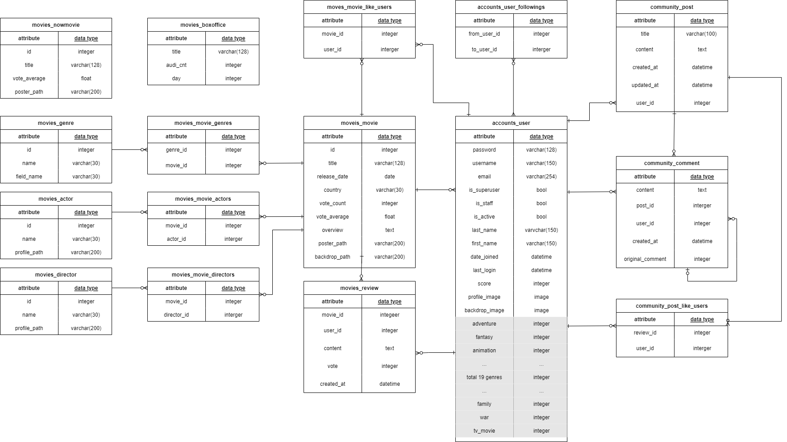

# 4. 대표 기능

## 4.1. 지속적인 업데이트

DB의 크기를 유동적으로 확장해나가며, 사용자가 최신의 정보에 접근할 수 있도록 다음의 기능들을 사용하였습니다.

### 4.1.1 Crontab

**Crontab** 라이브러리를 이용해 정해둔 시간마다 특정 함수가 실행되도록 할 수 있습니다. 이번 프로젝트에서는 메인화면에 나오는 '현재 상영 영화'와 '지난주 일별 관람객 추이' 정보를 업데이트 하가 위해 Crontab 라이브러리를 활용하였습니다.

하지만 Crontab 라이브러리는 해당 파일이 서버에서 24시간 돈다는 가정 하에만 유효합니다. 현재 11월 25일을 기준으로 서버가 원활히 돌아가는 것을 확인하였지만, 배포 관련하여 예기치 못한 변수가 많이 발생한만큼 지속적인 관찰이 필요합니다.

```python
# settings.py
INSTALLED_APPS = [
    ...
    'django_crontab',
    ]

CRONJOBS = [
    # 매일 자정 상영영화 TMDB API 요청으로 DB 업데이트
    ('* 0 * * *', 'movies.views.fill_movie_now_every_day', '>> schedule.log'),
    # 매주 월요일 지난주 일별 관객수 영화진흥회 API 요청으로 DB 업데이트
    ('* 1 * * 1', 'movies.views.ill_boxoffice_every_week', '>> schedule.log')
]
```

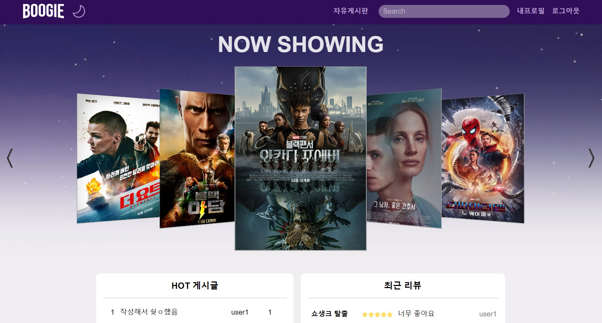

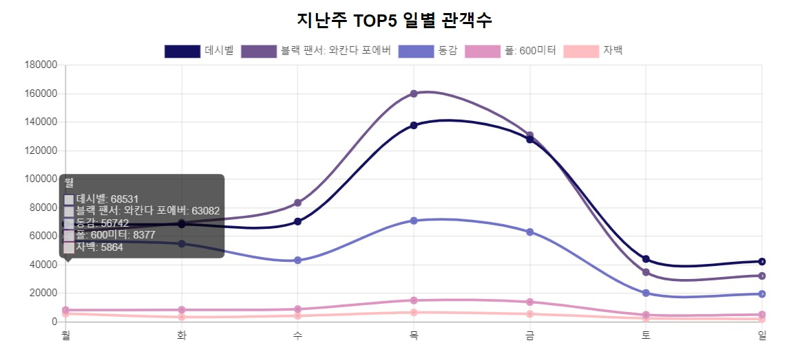

### 4.1.2 사용자 요청에 따른 DB확장

배포를 기점으로 현재 DB에 저장된 영화는 200개 뿐입니다. 하지만 사용자 요청에 따라 DB를 지속적으로 확장해나가도록 설계하였기 때문에, **사용자는 현재 데이터베이스 크기에 구애받지 않고 서비스를 이용할 수 있습니다.**

```python
# movies/views.py

@api_view(['GET'])
def movie_detail_unlogin(request, movie_pk):
    # Step1. 사용자 요청에 대해 먼저 DB를 검색
    try:
        movie = Movie.objects.prefetch_related('actors', 'directors', 'genres', 'like_users').get(pk=movie_pk)
    # Step2. 일치하는 정보가 없을 경우, TMDB API 요청을 통해 DB 확장 후, 응답
    except Movie.DoesNotExist:
        save_movie(movie_pk)
        movie = Movie.objects.prefetch_related('actors', 'directors', 'genres', 'like_users').get(pk=movie_pk)
    serializer = MovieSerializer(movie)
    data = serializer.data
    data['is_liked'] = False
    return Response(data)
```

## 4.2. 사용자-서버 간의 다양한 정보교환

사용자와의 적극적인 상호작용을 목표로, 다양한 라이브러리를 활용하여 DB Model을 설계하였습니다.

### 4.2.1. 대댓글 기능

댓글과 대댓글을 따로 관리하지 않고, 하나의 모델로 구현하였습니다. 아래 'original_comment' 필드가 자기 자신을 참조하는 외래키 필드이며, 대댓글이 아닌 원댓글의 경우 해당 필드의 값이 null로 입력됩니다.

```python
# community/models.py
class Comment(models.Model):
    content = models.TextField()
    post = models.ForeignKey(Post, on_delete=models.CASCADE)
    user = models.ForeignKey(settings.AUTH_USER_MODEL, on_delete=models.SET_NULL, null=True)
    created_at = models.DateTimeField(auto_now_add=True)
    # 자기 자신을 참조하는 외래키 필드
    original_comment = models.ForeignKey('self', on_delete=models.CASCADE, null=True)
```

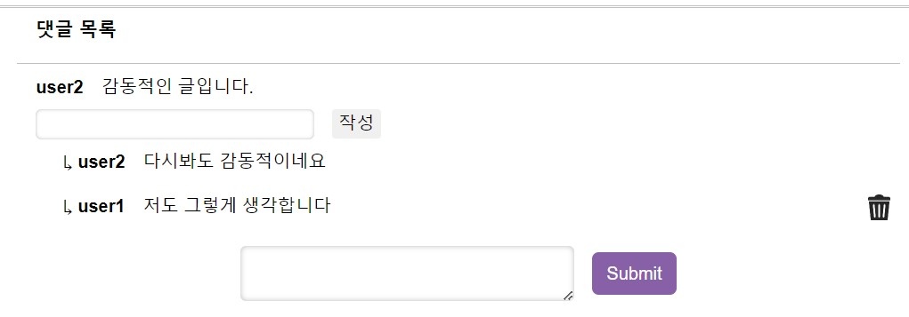

### 4.2.2. 프로필, 배경사진 업로드

유저는 프로필 사진과 배경사진을 업로드할 수 있습니다. 사용자가 업로드한 파일은 각각 `media/profile/{user_name}/`, `media/backdrop/{user_name}/` 경로로 저장됩니다.

그리고 제한된 서버를 효율적으로 구동하고자 **imagekit**, **django-cleanup**라이브러리를 활용하였습니다. imagekit의 ProcessedImageField를 사용하여 사용자가 업로드한 이미지를 웹페이지상에서 사용할 크기로 Crop하고, 이미지 품질을 유효한 범위 내에서 낮췄습니다. 또한 django-cleanup 라이브러리는 사용자가 프로필/배경화면 이미지를 업데이트할 경우, 기존 이미지를 삭제하여 DB를 가볍게 유지시켜줍니다.

```python
#settings.py
INSTALLED_APPS = [
    'imagekit',
    ...
    # django-cleanup은 마지막에 위치시키는 것을 권장
    'django_cleanup.apps.CleanupConfig',
]
```

```python
# accounts/models.py
from imagekit.processors import Thumbnail, ResizeToFill
from imagekit.models import ProcessedImageField


# Create your models here.
def profile_image_path(instance, filename):
    return f'profile/{instance.username}/{filename}'

def backdrop_image_path(instance, filename):
    return f'backdrop/{instance.username}/{filename}'

class User(AbstractUser):
    followings = models.ManyToManyField('self', symmetrical = False, related_name = 'followers')
    score = models.IntegerField(default=0)
    # profile_image = models.ImageField(default='/profile/default.png', blank=True, upload_to=profile_image_path)
    profile_image = ProcessedImageField(
        blank=True,
        default='profile/default.png',
        upload_to=profile_image_path,
        processors=[ResizeToFill(500, 500)],
        format='JPEG',
        options={'quality': 80},
        )
    # backdrop_image = models.ImageField(default='/backdrop/default.jpg', blank=True, upload_to=backdrop_image_path)
    backdrop_image = ProcessedImageField(
        blank=True,
        default='backdrop/default.jpg',
        upload_to=backdrop_image_path,
        processors=[ResizeToFill(1200, 600)],
        format='JPEG',
        options={'quality': 80},
        )
```

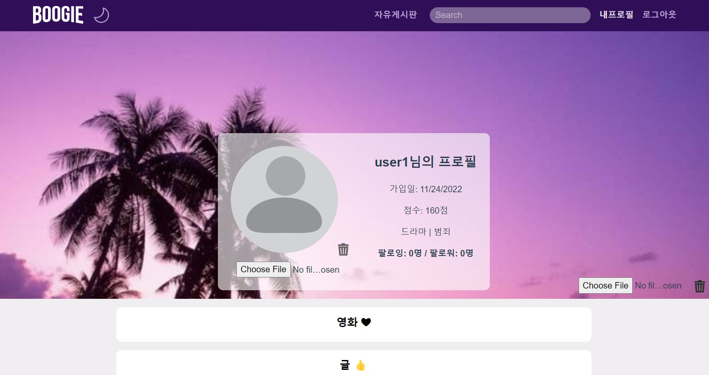

### 4.2.3. ckeditor

**ckeditor** 라이브러리는 유저가 보다 직관적으로 html문서를 작성할 수 있도록 도와줍니다. 옵션을 잘 활용하면 이미지, 동영상 같은 미디어 파일도 업로드할 수 있지만, 이번 프로젝트에서는 url을 통한 이미지 업로드 정도의 html문서 작성까지만 구현하였습니다.

```python
# settings.py
INSTALLED_APPS = [
    #ckeditor
    'ckeditor',
    'ckeditor_uploader',
]
```

```python
# community/models.py
from ckeditor_uploader.fields import RichTextUploadingField


# Create your models here.
class Post(models.Model):
    title = models.CharField(max_length=100)
    # ckeditor가 지원하는 RichTextUploadingField
    content = RichTextUploadingField(blank=True)
    created_at = models.DateTimeField(auto_now_add=True)
    updated_at = models.DateTimeField(auto_now=True)
    user = models.ForeignKey(settings.AUTH_USER_MODEL, on_delete=models.CASCADE)
    like_users = models.ManyToManyField(settings.AUTH_USER_MODEL, related_name = "like_posts")
```

```js
// main.js
import CKEditor from 'ckeditor4-vue'

Vue.use(CKEditor)
```

```html
<!-- PostCreateView.vue -->
<template>
  <ckeditor class="mt-3" v-model="content" :config="editorConfig"></ckeditor>
</template>
```

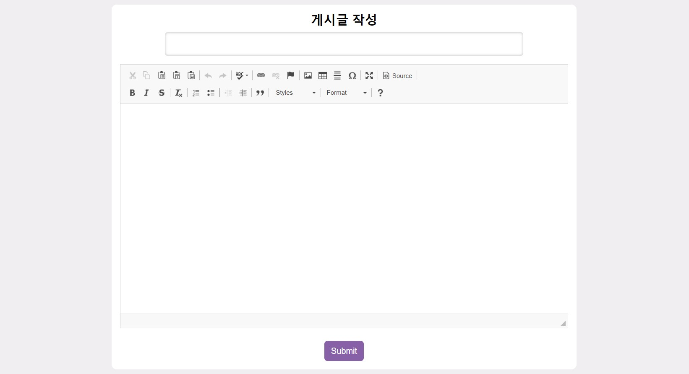

## 4.3. 직관적인 페이지 변환

직관적인 페이지 변환은 구현 자체는 간단하지만, 사용자의 입장에서 생각하며 세세한 부분까지 링크를 다는 과정이 필요했습니다.

### 4.3.1. 인덱스 페이지

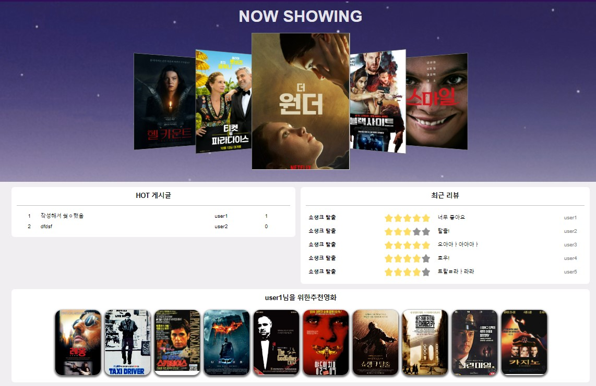

**영화 디테일 페이지**

- Now Shwing 항목의 영화 포스터를 클릭할 경우, 해당 영화의 디테일 페이지로 이동합니다.
- 추천 영화 항목의 영화 포스터를 클릭할 경우, 해당 영화의 디테일 페이지로 이동합니다.
- 최글 리뷰 항목의 리뷰를 클릭할 경우, 해당 영화의 디테일 페이지로 이동합니다.

**게시글 디테일 페이지**

- HOT 게시물의 게시물을 클릭할 경우, 해당 게시글의 디테일 페이지로 이동합니다.

**프로필 페이지**

- HOT 게시물의 유저 이름을 클릭할 경우, 해당 유저의 프로필 페이지로 이동합니다.
- 최근 리뷰의 유저 이름을 클릭할 경우, 해당 유저의 프로필 페이지로 이동합니다.

### 4.3.2. 커뮤니티 페이지

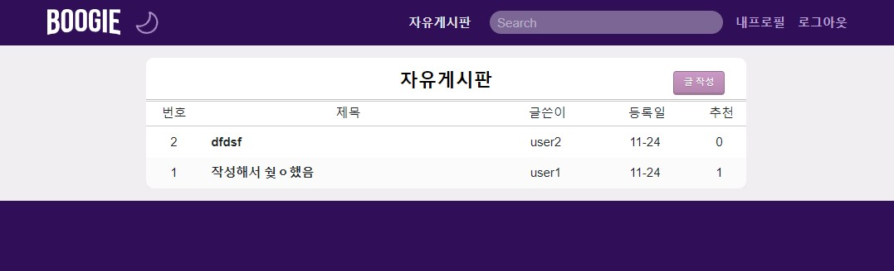

**게시글 페이지**

- 게시글을 클릭할 경우, 해당 게시글의 디테일 페이지로 이동합니다.

**프로필 페이지**

- 게시글의 유저 이름을 클릭할 경우, 해당 유저의 프로필 페이지로 이동합니다.

### 4.3.3. 영화 디테일 페이지

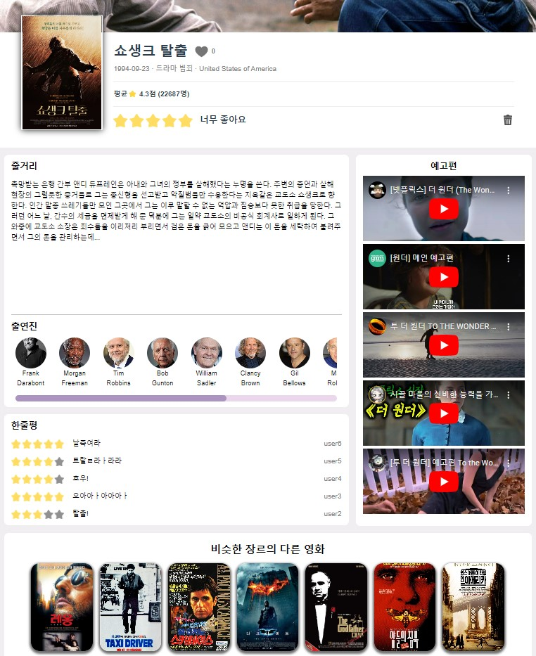

**구글 검색 페이지**

- 출연진 사진을 클릭할 경우, 해당 출연진의 구글 검색 페이지 새 창이 뜹니다.

**프로필 페이지**

- 한줄평의 유저 이름을 클릭할 경우, 해당 유저의 프로필 페이지로 이동합니다.

**영화 디테일 페이지**

- 비슷한 장르 영화의 포스터를 클릭할 경우, 해당 영화의 디테일 페이지로 이동합니다.

### 4.3.4. 검색 페이지

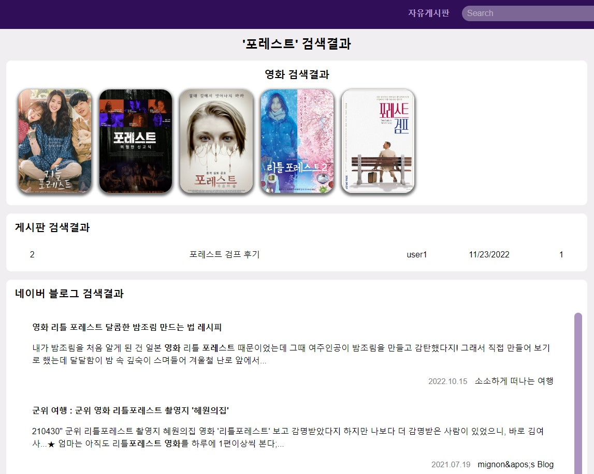

**영화 디테일 페이지**

- 영화 검색 결과의 포스터를 클릭할 경우, 해당 영화의 디테일 페이지로 이동합니다.

**게시글 디테일 페이지**

- 게시판 검색결과의 게시글을 클릭할 경우, 해당 게시글의 디테일 페이지로 이동합니다.

**네이버 블로그 페이지**

- 네이버 블로그 검색결과의 결과물을 클릭할 경우, 해당 블로그 게시글 새 창이 뜹니다.

### 4.3.5. 프로필 페이지

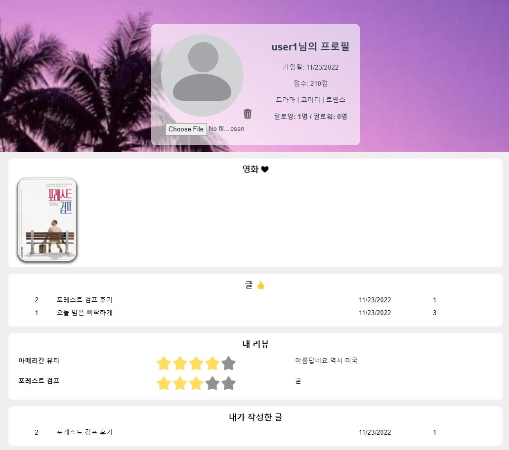

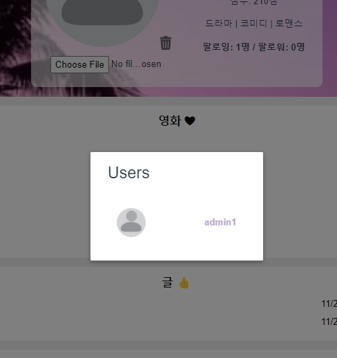

**영화 디테일 페이지**

- 좋아요한 영화의 포스터를 클릭할 경우, 해당 영화의 디테일 페이지로 이동합니다.
- 내 리뷰의 리뷰를 클릭할 경우, 해당 영화의 디테일 페이지로 이동합니다.

**게시글 디테일 페이지**

- 좋아요 한 글의 게시글을 클릭할 경우, 해당 게시글로 이동합니다.
- 내가 쓴 글의 게시글을 클릭할 경우, 해당 게시글로 이동합니다.

**프로필 페이지**

- 좋아요 한 글의 게시글의 유저이름을 경우, 해당 유저의 프로필 페이지로 이동합니다.
- 상단의 팔로워 / 팔로잉을 클릭할 경우, 해당하는 유저 목록이 뜨고, 유저를 클릭할 경우 해당 유저의 프로필 페이지로 이동합니다.

# 5. 영화추천 알고리즘

사용자의 활동기록(좋아요, 리뷰)을 바탕으로 사용자의 장르 선호도를 기록하고, 이를 활용하여 영화를 추천합니다.

## 5.1. DB 설계

이번 프로젝트에서 활용하는 TMDB 사이트의 장르 정보가 고정되어 있다는 점을 참고하여, 각 유저 별로 TMDB가 제공하는 모든 장르에 대한 IntegerField 필드를 추가하였습니다.

```python
# accounts/models.py
class User(AbstractUser):
    ...
    adventure = models.IntegerField(default=0)
    fantasy = models.IntegerField(default=0)
    animation = models.IntegerField(default=0)
    drama = models.IntegerField(default=0)
    horror = models.IntegerField(default=0)
    action = models.IntegerField(default=0)
    comedy = models.IntegerField(default=0)
    history = models.IntegerField(default=0)
    western = models.IntegerField(default=0)
    thriller = models.IntegerField(default=0)
    crime = models.IntegerField(default=0)
    documentary = models.IntegerField(default=0)
    science_fiction = models.IntegerField(default=0)
    mystery = models.IntegerField(default=0)
    music = models.IntegerField(default=0)
    romance = models.IntegerField(default=0)
    family = models.IntegerField(default=0)
    war = models.IntegerField(default=0)
    tv_movie = models.IntegerField(default=0)
```

## 5.2. 사용자 취향 추적

**영화 좋아요**

- 유저가 특정 영화를 좋아요한 경우, 해당 영화가 가지는 모든 장르에 대응하는 유저의 필드값을 +1 증가 시킵니다.

**리뷰 작성**

- 유저가 특정 영화에 대한 리뷰를 남긴 경우, 해당 영화가 가지는 모든 장르에 대응하는 유저의 필드값을 업데이트 합니다. 별점 5점 만점에 대해서 -3한 값을 필드에 더해줍니다.

```python
# movies/views.py

# 특정 영화를 좋아요한 경우
@api_view(['POST'])
@permission_classes([IsAuthenticated])
def movie_like(request, movie_pk):
    movie = Movie.objects.prefetch_related('genres').get(pk=movie_pk)
    # 장르 선호도 업데이트를 위한 준비
    user = get_user_model().objects.get(pk=request.user.pk)
    original_data = UserPreferenceSerializer(user).data
    genres = movie.genres.all()

    if movie.like_users.filter(pk=request.user.pk).exists():
        movie.like_users.remove(request.user)
        is_liked = False
        # 유저의 장르선호도 업데이트
        for genre in genres:
            g = Genre.objects.get(pk=genre.id)
            original_data[g.field_name] -= 1
        updated_serializer = UserPreferenceSerializer(user, data=original_data)
        if updated_serializer.is_valid(raise_exception=True):
            updated_serializer.save()
    ...
```

```python
# movies/views.py

# 특정 영화에 대한 리뷰를 남긴 경우
@api_view(['GET', 'POST'])
def review_list_movie(request, movie_pk):
    movie=Movie.objects.get(pk=movie_pk)

    if request.method == 'GET':
        reviews = Review.objects.filter(movie=movie).order_by('-created_at')
        serializer = ReviewSerializer(reviews, many=True)
        return Response(serializer.data)

    elif request.method == 'POST' and request.user.is_authenticated:
        serializer = ReviewSerializer(data=request.data)
        if serializer.is_valid(raise_exception=True):
            serializer.save(movie=movie, user=request.user)
            ...
            # 장르 선호도 업데이트를 위한 준비
            user = get_user_model().objects.get(pk=request.user.pk)
            original_data = UserPreferenceSerializer(user).data
            genres = movie.genres.all()

            # 유저의 장르선호도 업데이트
            vote = request.data['vote'] - 3
            for genre in genres:
                g = Genre.objects.get(pk=genre.id)
                original_data[g.field_name] += vote
            updated_serializer = UserPreferenceSerializer(user, data=original_data)
            if updated_serializer.is_valid(raise_exception=True):
                updated_serializer.save()

            return Response(serializer.data, status=status.HTTP_201_CREATED)
```

## 5.3. 영화 추천

추적한 사용자의 장르 취향을 바탕으로 영화를 추천합니다. DB에 존재하는 모든 영화를 긁어온 뒤에, 각 영화가 가지는 장르에 대한 유저의 선호도를 단순 합산합니다. 합산 결과가 큰 순서대로 정렬하여 상위 10개의 영화를 반환합니다.

```python
# movies/views.py

@api_view(['GET'])
@permission_classes([IsAuthenticated])
def movie_list_recommend(request):
    # 유저의 장르 선호도 가져오기
    user = get_user_model().objects.get(pk=request.user.pk)
    genre_preference = UserPreferenceSerializer(user).data

    # 모든 영화를 장르 리스트 포함해서 가져오기
    serializer = MovieListGenreSerializer(Movie.objects.all(), many=True)
    movies = serializer.data

    # 선호도별 점수를 매겨 sort
    id_to_field_name = {12:	'adventure', 14: 'fantasy', 16:	'animation', 18	: 'drama', 27: 'horror', 28: 'action', 35: 'comedy', 36: 'history', 37:	'western', 53: 'thriller', 80: 'crime', 99: 'documentary', 878: 'science_fiction', 9648	: 'mystery', 10402: 'music', 10749: 'romance', 10751: 'family', 10752: 'war', 10770: 'tv_movie',}
    def calculate_score(movie):
        score = 0
        genres = movie['genres']
        for genre in genres:
            field_name = id_to_field_name[genre]
            score += genre_preference[field_name]
        return score
    movies.sort(key= lambda x: calculate_score(x), reverse=True)

    return Response(movies[:10])
```

# 6. 배포서버 URL

**Vue 클라이언트 주소**

- https://boogiee-site.netlify.app/

**Django 서버 주소**

- 비공개

## 6.1. 배포 과정 중 어려웠던 점

**https에서 http로의 요청**

- gunicorn으로 서버를 실행하고, netflify에서 클라이언트 측에 주어진 주소를 이용하여 접속을 시도하는 과정에서 문제가 발생하였습니다. netflify의 주소는 https 프로토콜을 사용하는데, aws에 올라간 django서버의 주소는 http 프로토콜을 사용하기 때문이었습니다. 이를 해결하기 위해 서버측에서도 https로 된 도메인을 구입하여 aws에 연결해주었다.

**서버의 잦은 종료**

- aws에 등록된 인스턴스가 계속해서 종료가 되는 일이 발생하였습니다. 이러한 경우 서버의 ip가 계속 변동되어 클라이언트 측 axios 요청 주소를 바꿔줘야하는 문제가 개발 단계에서 가장 큰 영향을 미쳤고, 따라서 탄력적 ip를 발급 받아 인스턴스에 연결하였습니다. 단 탄력적 ip의 경우 인스턴스에 연결이 안되면 이용요금이 부과될 수 있기 때문에. 이후 인스턴스 삭제 시 탄력적 ip를 또한 같이 삭제해줘야 합니다.
- 그리고 서버의 종료 문제를 해결하기 위해 다양한 방법을 시도해보았습니다.먼저 cloud9 터미널이 종료되어도 서버가 계속 돌아갈 수 있도록, 서버 실행시에 nohup을 앞에 붙여보았으나 해결이 되지 않았습니다. 둘째로 nginx를 이용하여 서비스 등록을 해보았으나 성공하지 못했습니다. 마지막으로 aws 인스턴스 설정을 항상 실행되도록 바꿈으로써 해결해냈습니다.

# 7. 기타) 성능 개선

## 7.1. 대댓글 DB 히트 수

처음 함수를 설계 시, 댓글과 대댓글을 구분하여 웹페이지 상에 뿌리기 위해, 각 댓글에 대해 역참조하는 대댓글이 있는지를 DB에서 매번 확인하였습니다. 즉 어떤 게시글에 10개의 원댓글이 있다면, 해당 게시글을 구현하기 위해 1+10번 DB를 히트하는 상황이 발생하였습니다.

이러한 비효율성을 개선하고자 한 번의 히트로, 특정 게시글의 모든 댓글을 긁어온 뒤에 이를 Vue에서 JavaScript로 적절히 가공하여, `[{ 원댓글 id : [원댓글 객체, 대댓글 객체] }]` 형태로 만들어 사용하였습니다.

```javascript
getComments() {
      axios({
        method: 'get',
        url: `${this.API_URL}/community/posts/${this.$route.params.postId}/comments/`,
      })
        .then((res) => {
          const comments = res.data
          // 댓글 정렬
          let i = 0
          let commentsRef = {}
          let orderedComments = []
          comments.forEach((comment) => {
            if (comment.original_comment === null) {
              commentsRef[comment.id] = i
              orderedComments.push([comment])
              i += 1
            } else {
              orderedComments[commentsRef[comment.original_comment]].push(
                comment
              )
            }
          })
          this.orderedComments = orderedComments
        })
        .catch((err) => {
          console.log(err)
        })
    }
```

## 7.2. 사용자 정보 Prefetch

프로필 페이지에서 사용자 정보를 받을 때는, (팔로잉, 팔로워, 좋아요한 글, 작성한 글, 좋아요한 영화, 작성한 리뷰) 등 다양한 찹조/역참조 관계의 데이터를 긁어와야 합니다. 이러한 요청을 따로 따로 보내면 DB 히트 수가 그만큼 증가합니다. 따라서 특정 유저의 대한 요청이 들어왔을 때 `prefetch_related()`함수를 활용하여 관련된 테이블들을 조인하여 한 번에 읽어내는 방식으로 DB 히트 수를 줄였습니다.

```python
@api_view(['GET'])
@permission_classes([IsAuthenticated])
def user_info(request, username):
    if request.method == 'GET':
        User = get_user_model()

        user = User.objects.prefetch_related(
            'followings', 'followers',
            'post_set', 'like_posts',
            Prefetch('like_movies', queryset=Movie.objects.prefetch_related('genres')),
            'review_set',
        ).get(username=username)
    ...
```
