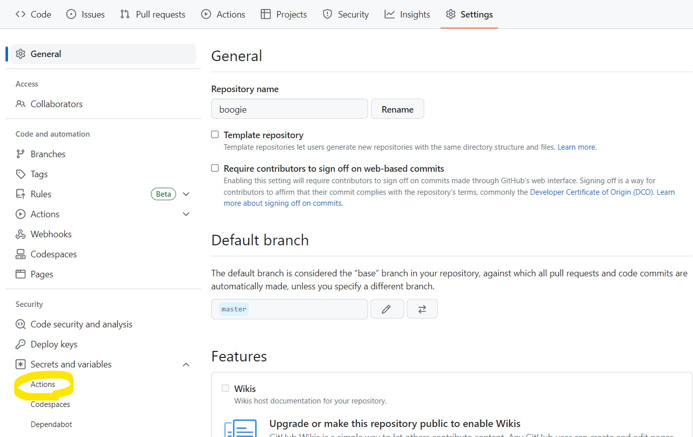

# How to Deploy Vue and Django<!-- omit in toc -->

[Boogie](https://github.com/Byongho96/boogie-project) 프로젝트에 사용된 Django와 Vue의 자동 빌드/배포 방식을 정리한 문서이다.

- SSH 키를 이용해 GitHub Action으로 원격 EC2에 쉘커맨드를 실행시키는 방식으로 배포를 진행했다.  
  [GitHub Action for executing remote ssh commands](https://github.com/appleboy/ssh-action)
- 이 방식은 간단하지만 외부에서 EC2 자원에 직접 접근한다는 이슈가 있다. 보다 정형화된 방법 중 하나로 Github Actiond로 빌드한 파일을 AWS S3에 업로드 하고, 이를 CodeDeploy 서비스를 이용해 EC2 상에 배포하는 방식이 있는 것 같다.

## Index<!-- omit in toc -->

- [1. Django](#1-django)
  - [1.1. .env](#11-env)
    - [1.1.1. Django env 파일 작성](#111-django-env-파일-작성)
    - [1.1.2. django-environ](#112-django-environ)
    - [1.1.3. .gitignore](#113-gitignore)
  - [2. DEBUG](#2-debug)
    - [2.1. ALLOWED_HOSTS](#21-allowed_hosts)
    - [2.2. 정적파일 제공](#22-정적파일-제공)
- [2. Vue](#2-vue)
  - [2.1. .env](#21-env)
- [3. EC2](#3-ec2)
  - [3.1. pyenv 설치](#31-pyenv-설치)
  - [3.2. 프로젝트 초기 설정](#32-프로젝트-초기-설정)
  - [3.3. gunicorn](#33-gunicorn)
  - [3.4. nginx](#34-nginx)
- [4. Github Actions](#4-github-actions)

# 1. Django

개발 중이던 Django 프로젝트를 실제 배포하기 위해서는, 보안상의 이슈를 방지하기 위해 최소한 다음의 절차는 이행해야 한다.

## 1.1. .env

.env 파일은 프로젝트의 환경변수를 저장하기 위한 **단순 문자열**파일이다.
API_KEY나 비밀번호와 같은 값들은 외부에 공개되면 안되기 때문에, 프로젝트에 하드코딩하지 않고 따로 .env 파일 등에 저장하고 사용해야 한다. 그리고 해당 .env 파일을 .gitignore에 추가함으로써 github과 같은 오픈소스에 올라가지 않도록 한다.

### 1.1.1. Django env 파일 작성

- **.env 파일 컨벤션**

  - 변수 이름은 영어 대문자와 '\_'의 조합으로 이뤄져야 한다.
  - 변수 이름과 값은 '='로 연결되며, 사이에 공백은 들어가지 않는다.

- **Django .env 예시**  
  SECRET_KEY는 모든 Django 프로젝트에 공통적으로 생성해야 할 환경변수이다.
  ```
  SECRET_KEY=your-django-secret-key
  API_KEY=your-api-key
  ```

### 1.1.2. django-environ

[django-environ](https://django-environ.readthedocs.io/en/latest/)은 Django 프로젝트에서 환경변수 파일을 사용하기 위한 Python 패키지이다.

아래 내용은 공식문서의 내용을 간략히 요약해서 작성했다.

1. **django-environ 설치**  
   django-envrion은 가상환경 내에 설치하는 것을 권장한다.

   ```bash
   python -m pip install django-environ
   ```

2. **.env 파일 생성**  
   [위의 예시](#111-django-env-파일-작성)에서처럼 본인의 Django 프로젝트에 쓰일 .env 파일을 생성한다. 생성한 .env 파일은 프로젝트의 루트 경로(manage.py가 위치한 곳)에 위치시킨다.

3. **settings.py 수정**

   ```python
   import environ
   import os

   env = environ.Env(
       # env파일에 있는 DEBUG 환경변수를 Boolean으로 타입변환한다.
       # 만일 DEBUG 환경변수가 없을 경우, default값은 False이다.
       DEBUG=(bool, False)
   )

   # 공식문서에서는 아래와 같이 BASE_DIR을 지정하지만, 그럴 경우 settings.py파일 내에서 BASE_DIR / 'subdir' 형식으로 파일경로를 지정할 수 없다.
   # BASE_DIR = os.path.dirname(os.path.dirname(os.path.abspath(__file__)))

   # 그래서 나는 Django 프로젝트 생성 시 자동 생성되었던 BASE_DIR을 그대로 사용했다.
   BASE_DIR = Path(__file__).resolve().parent.parent

   # BASE_DIR 위치를 기준으로 .env 파일을 읽어온다.
   environ.Env.read_env(os.path.join(BASE_DIR, '.env'))

   # 처음 설정 때문에, .env 파일에 DEBUG관련 설정이 없을 경우 False값이 자동 배정된다.
   # SECURITY WARNING: don't run with debug turned on in production!
   DEBUG = env('DEBUG')

   # SECRET_KEY는 Django 프로젝트에 반드시 필요한 값이다. (없을 경우 ImproperlyConfigured 가 발생)
   # SECURITY WARNING: keep the secret key used in production secret!
   SECRET_KEY = env('SECRET_KEY')
   ```

### 1.1.3. .gitignore

.env 파일에 변수를 옮긴 이유는 이를 외부에 공개하지 않기 위해서이다. 따라서 반드시 .gitignore파일에 .env를 추가된 것을 확인해야한다.

```gitignore
# Environments
.env
.venv
env/
venv/
ENV/
env.bak/
venv.bak/
```

그 결과, 당연히 .env파일이 git에 올라가지 않는다. 때문에 배포 호스트에서 동일 위치에 .env파일을 직접 생성해줘야한다. [아래에 관련 내용](#33-env-파일-생성)을 정리했다.

## 2. DEBUG

처음 Django Project를 생성하면, 다음과 같이 배포환경에서 절대 DEBUG 모드를 켜지 사용하지 말라는 주석문구가 달린다. 즉 배포환경에서는 DEBUG를 False로 둬야한다.

```python
# SECURITY WARNING: don't run with debug turned on in production!
DEBUG = env('DEBUG')
```

[Django 공식문서](https://docs.djangoproject.com/en/4.2/ref/settings/#debug)를 살펴보면, DEBUG가 True일 경우 에러가 발생했을 때 구체적인 에러를 표시하고 (아마 Django가 풀스택 프레임워크로 사용될 때 특히나 큰 영향이 클 것 같다.), 손쉬운 디버깅을 위해 실행된 SQL를 모두 기억하기 때문에 배포환경에서 메모리를 빠르게 잡아먹는다고 한다.

즉 요점만 말하면 DEBUG를 False로 설정하고 배포해야 하는데, 문제는 DEBUG를 False로 바꾸는 순간 True일 때는 발생하지 않았던 문제들이 나타난다.

### 2.1. ALLOWED_HOSTS

DEBUG가 False일 때는 프로젝트를 실행시키는 호스트의 IP 주소를 명시해줘야 한다.

```python
# settings.py

ALLOWED_HOSTS = [
    '127.0.0.1',  # 로컬 IP 주소
    {EC2 IP 주소}, # EC2 IP 주소
]
```

### 2.2. 정적파일 제공

이 문제 때문에 한동안 골머리를 앓았다... 배포하니까 갑자기 media파일을 get하는 요청에서 Not Found 에러가 나는 것이었다.

구글링하다가 [Django 포럼 커뮤니티](https://forum.djangoproject.com/t/django-static-files-in-deployment-debug-false/16675/2)에서 동일한 QnA가 올라온 것을 찾았고, 그에 대한 답변이 Django는 DEBUG=False일 때 정적파일을 제공하지 않는다는 것이었다...! 따라서 Nginx와 같은 웹서버를 사용하란다.

즉, 배포 환경에서는 우리가 해준 아래 설정이 딱히 필요없어지는 것이다.

```python
from django.conf import settings
from django.conf.urls.static import static

urlpatterns = [
    ...
] + static(settings.MEDIA_URL, document_root=settings.MEDIA_ROOT)

```

나는 Nginx를 이용해서 정적파일을 제공했고, 관련된 수정사항은 아래 [nginx항목](#34-nginx)에서 확인할 수 있다.

# 2. Vue

## 2.1. .env

프론트엔드 프로젝트도 마찬가지로 .env 파일을 통해 프로젝트의 환경변수를 설정할 수 있다. 그런데 몇 가지 차이점이 있다.

- **보안 취약**  
  프론트엔드 프로젝트는 서버에서 실행되는 게 아니라, 빌드 되어 하나의 정적파일(index.html)로 제공된다. 따라서 환경변수도 빌드 시에 정적파일에 포함되기 때문에, 이를 브라우저에서 **크롬 개발자 도구 등**으로 확인할 수 있다.  
  따라서 추가적인 보안절차를 더하거나, 혹은 애초에 프론트엔드에 보안 이슈와 관련된 환경변수를 사용하지 않는다. 나는 후자를 선택해서 Youtube API key 등을 모두 백서버에서 관리하고, 프론트는 백서버에 요청해 데이터를 한 단계 거쳐 전달받도록 했다.

- **.env 파일 우선순위**  
   프론트엔드의 .env파일은 여러 종류가 있고, 이들 간의 우선순위가 다르다.  
   js기반 프로젝트에는 **NODE_ENV**라는 환경변수가 기본적으로 있어, 'production'와 'development' 두가지 값을 가진다. 간단하게만 말하면, Vue 프로젝트가 `npm run serve` 명령어로 실행되면 NODE_ENV는 'development'값을 가지고, `npm run build`명령어로 실행되면 'production'값을 가진다.  
   그리고 그에 따라서 다른 환경변수 파일을 참조하는데, 그 우선순위는 아래와 같다.
  - **Development**: .env.development.local > .env.local > .env.development > .env
  - **Development**: (npm run build): .env.production.local > .env.local > .env.production > .env

나는 앞서 말한 프론트엔드 프로젝트 환경변수 파일의 **보안 취약점**때문에 보안상으로 문제되는 환경변수는 백엔드로 옮기고, 기타 로컬환경과 배포환경에서 달라야하는 환경변수를 .env와 .env.production에 나눠 설정한 뒤, git에 반영했다.

```env
# .env
VUE_APP_SERVER_URL=http://127.0.0.1:8000
```

```env
# .env.production
VUE_APP_SERVER_URL=http://boogie-movie.site
```

# 3. EC2

아래 내용은 AWS EC2상에서 진행된다. EC2와 ssh 키가 없거나 접속하는 법을 모르면 [AWS EC2 기초 가이드](https://github.com/Byongho96/TIL/blob/master/Tools/AWS.md)를 참고하면 된다.

## 3.1. pyenv 설치

[pyenv](https://github.com/pyenv/pyenv)는 여러 개의 Python버전을 쉽게 관리할 수 있도록 도와주는 도구다.

아래 내용은 [공식 pyenv Github 문서의 shell환경 설치](https://github.com/pyenv/pyenv)를 따라 정리했다.

1. **pyenv github repo 클론**

   ```bash
   git clone https://github.com/pyenv/pyenv.git ~/.pyenv
   ```

2. **환경변수와 PATH 등록**

   ```bash
   # 현재 사용자(.bashrc)에 대해 PYENV_ROOT 환경변수를 지정한다.
   echo 'export PYENV_ROOT="$HOME/.pyenv"' >> ~/.bashrc
   # pyenv가 설치되어 있는지 확인하고, 설치되어있지 않으면 PATH 환경 변수에 pyenv 경로(~/.pyenv/bin)을 추가한다.
   # PATH는 : 를 기준으로 참조하는 디렉토리를 구분해서 저장한다.
   # bin폴더에 실행 가능한 파일지 저장된다.
   echo 'command -v pyenv >/dev/null || export PATH="$PYENV_ROOT/bin:$PATH"' >> ~/.bashrc
   # (pyenv init -)는 pyenv 초기화 쉘코드를 출력하고, 이를 .bashrc에 추가해서 로그인시마다 pyenv를 초기화시킨다.
   echo 'eval "$(pyenv init -)"' >> ~/.bashrc
   ```

   ```bash
   # 로그인 환경변수(.profile)에도 적용한다.
   echo 'export PYENV_ROOT="$HOME/.pyenv"' >> ~/.profile
   echo 'command -v pyenv >/dev/null || export PATH="$PYENV_ROOT/bin:$PATH"' >> ~/.profile
   echo 'eval "$(pyenv init -)"' >> ~/.profile
   ```

3. **shell 재시작**  
   PATH 변경사항을 반영하기 위해 shell을 재시작한다.

   ```bash
    exec "$SHELL"
   ```

4. **Python build dependcies 설치**
   ```bash
   sudo apt update; sudo apt install build-essential libssl-dev zlib1g-dev \
   libbz2-dev libreadline-dev libsqlite3-dev curl \
   libncursesw5-dev xz-utils tk-dev libxml2-dev libxmlsec1-dev libffi-dev liblzma-dev
   ```
5. **pyenv 설치 확인**

   ```bash
   pyenv -v

   # 출력 확인 => pyenv VERSION_INFO
   ```

6. **python 설치**
   필요한 버전의 python을 설치한다

   ```bash
   pyenv install 3.9.X
   pyenv global 3.9.X
   python -V
   ```

## 3.2. 프로젝트 초기 설정

1. **프로젝트 클론**
   ```bash
   cd ~
   git clone {project_remote_url}
   ```
2. **Django .env 생성**
   ```bash
   cd {장고_프로젝트_폴더}
   sudo vi .env
   # vi 에디터 사용법을 모를 경우, 구글링해보자
   ```
   vi가 없을 시, 아래 명령어로 설치
   ```bash
   sudo apt-get update
   sudo apt-get install vim
   ```
3. **Django 가상환경 설정**
   ```bash
   cd {장고_프로젝트_폴더}
   python -m venv venv
   source venv/bin/activate
   pip install -r requirements.txt
   ```
4. **Django DB 생성**

   ```bash
   python manage.py migrate

   # fixture가 있는 경우
   python manage.py loaddata {fixture 파일}
   ```

5. **Django collectstatic**  
   제공할 static파일이 있을 경우, 아래 명령어로 static파일을 모은다.
   Django의 DEBUG값이 False일 경우, [위에서](#22-정적파일-제공) 언급한 것처럼 Django는 정적파일을 제공하지 못한다. [따라서 이 또한 Nginx에서 처리해줘야 한다.](#34-nginx)

   ```python
   # settings.py

   STATIC_ROOT = BASE_DIR / 'staticfiles'
   ```

   ```bash
   python manage.py collectstatic
   ```

6. **node.js 설치**  
   [Ubuntu 20.04 Node.js 설치](https://linuxize.com/post/how-to-install-node-js-on-ubuntu-20-04/)
   ```bash
   sudo apt update
   sudo apt install nodejs npm
   nodejs --version
   ```
   Vue 프로젝트를 빌드하기 위해서는 nodejs의 버전이 v12.x 이상이어야 한다. 위 명령어에서 확인한 버전이 12.x 미만일 경우, 아래 명령어를 따라한다.
   ```bash
   # node 설치관련 스크립트를 다운받고, bash 쉘을 root권한으로 재시작한다.
   curl -sL https://deb.nodesource.com/setup_12.x | sudo -E bash -
   sudo apt install nodejs
   node --version
   ```
7. **build-essential 설치**  
   노드 패키지(모듈)에서 C/C++로 작성된 부분을 natvie addons라고 말하고, 이러한 패키지를 설치하기 위해서는 해당 운영 체제에서 빌드(컴파일) 도구를 설치해야 한다.
   ```bash
   sudo apt install build-essential
   ```
8. **npm module 설치**
   ```bash
   cd {Vue_프로젝트_폴더}
   npm install
   ```
9. **Vue 프로젝트 빌드**  
   Vue 프로젝트를 빌드할 경우, 프로젝트 루트경로 dist폴더 내에 index.html파일이 생성된다.
   ```bash
   npm run buld
   ```

## 3.3. gunicorn

Django의 기존 `runserver`명령어는 배포환경에서 사용하면 안된다. [Django 공식문서](https://docs.djangoproject.com/en/4.2/ref/django-admin/#runserver)에 따르면, 이는 개발 서버로써 보안과 성능을 보장하지 않기 때문이다.

Python프레임워크의 대표적인 WSGI(Web Server Gateway Interface) 중 하나가 [gunicorn](https://docs.gunicorn.org/en/stable/install.html)이다.

1. **gunicorn 설치**  
   django 프로젝트 가상환경 내에서 설치한다.
   ```bash
   pip install gunicorn
   ```
2. **ALLOWED_HOSTS 확인**  
   gunicorn을 통해 Django를 서비스하기 위해서는 ALLOWED_HOSTS를 지정해줘야 한다.

   ```python
   # settings.py

   ALLOWED_HOSTS = [
       '127.0.0.1',  # 로컬 IP 주소
       {EC2 IP 주소}, # EC2 IP 주소
   ]
   ```

3. **gunicorn 시스템 서비스 등록**  
    gunicorn이 운영체제의 백그라운드에서 돌아가도록 시스템 서비스에 등록한다. 시스템 서비스에 등록하기 위해서는 `/etc/systemd/system/`경로에 .service파일을 작성해야한다.

   ```bash
   sudo vi /etc/systemd/system/gunicorn.service
   ```

   unit 설정 파일 작성법은 [Linux.md](https://github.com/Byongho96/TIL/blob/master/Tools/Linux.md#32-service)에 정리해두었다.
   아래 gunicorn 명령어에서 workers란 gunicorn의 프로세스 수를 의미하며, workers를 높게 설정하면 서버의 처리 속도가 높아질 수 있지만, 동시에 높은 메모리 사용량과 높은 CPU 사용률이 발생하기 때문에 CPU 코어 수를 기준으로 설정한다.

   ```c
   [Unit]
   Description=gunicorn daemon
   After=network.target

   [Service]
   User=ubuntu
   Group=www-data
   WorkingDirectory=/home/ubuntu/{장고 프로젝트 폴더}
   ExecStart=/home/ubuntu/{장고 프로젝트 폴더}/venv/bin/gunicorn \
           --workers 3 \
           --bind 127.0.0.1:8000 \
           {장고 마스터 앱}.wsgi:application

   [Install]
   WantedBy=multi-user.target
   ```

   unit파일 작성 후, 시스템 데몬을 재시작 하고, gunicorn 서비스를 실행시킨다.

   ```bash
   sudo systemctl daemon-reload

   sudo systemctl start gunicorn
   sudo systemctl enable gunicorn
   sudo systemctl status gunicorn.service

   # 중지
   # sudo systemctl stop gunicorn

   # 재시작
   # sudo systemctl restart gunicorn
   ```

## 3.4. nginx

Nginx를 웹서버로 사용해서 정적 파일을 제공하고 api요청을 reverse proxy한다.  
Nginx에 대한 더 자세한 설명은 [Nginx.md](https://github.com/Byongho96/TIL/blob/master/Tools/Nginx.md)에 정리되어 있다.

1. **nginx 설치**

   ```
   sudo apt-get update
   sudo apt-get install -y nginx
   ```

2. **nginx 설정파일 작성**  
   `/etc/nginx/sites-available` 경로에 nginx 설정파일을 원하는 이름으로 작성한다. 보통 하나의 설정파일이 site에 해당하기 때문에 원하는 사이트 이름으로 하는 것을 추천한다.

   ```
   sudo vi /etc/nginx/sites-available/{프로젝트 이름}
   ```

   nginx 설정파일은 프로젝트에 따라서 달라진다.

   - STATIC_ROOT와 MEDIA_ROOT는 settings.py에서 확인해야 하는데, 보통 STATIC_ROOT는 'staticfiles'로 설정하고, MEDIA_ROOT는 'media'로 설정되는 경향이 있다.
   - 나는 Django로 가는 url요청의 엔드포인트를 모두 `/api`로 통일시켜서 아래와 같이 작성했다.
   - website 기본 url로 접근했을 경우, Vue 프로젝트의 index.html을 반환하기 위해 아래와 같이 빌드된 index.html이 있는 경로(`dist/`)로 proxy해주었다.

   ```nginx
   server {
        listen 80;
        server_name {서버IP주소};

        location /static/ {
                alias {장고 프로젝트 루트 경로}/{STATIC_ROOT}/;
        }

        location /media/ {
                alias {장고 프로젝트 루트 경로}/{MEDIA_ROOT}/;
        }

        location /api {
                include proxy_params;
                proxy_pass http://127.0.0.1:8000;
        }

        location / {
                root {Vue 프로젝트 루트 경로}/dist/;
                index index.html;
                try_files $uri $uri/ /index.html;
        }
    }
   ```

3. **nginx 설정파일 활성화**  
   작성한 설정파일을 실제로 활성화 하기 위해서는 `sites-enabled`폴더에 등록되어야 한다. 따라서 소프트링크를 생성한다.

   ```bash
   sudo ln -s /etc/nginx/sites-available/{설정파일 이름} /etc/nginx/sites-enabled
   ```

4. **nginx 재시작**

   ```bash
   # 80번 포트의 프로세서 종료
   sudo lsof -t -i tcp:80 -s tcp:listen | sudo xargs kill

   # nginx 재시작
   sudo systemctl restart nginx
   ```

# 4. Github Actions

지금까지 위의 모든 절차를 따라했다면 배포가 완료되었다. EC2 IP주소로 접속해서 확인해볼 수 있다.

이제는 github actions를 이용해 github 레포지토리에 push하였을 경우, 자동 빌드/배포가 되는 환경을 구축해볼 것이다. **다시 말하지만, ssh 키로 EC2에 접속해 직접 쉘명령어로 레포지토리를 클론하고 빌드 명령어를 실행시키는 아주 간이적인 방법이다.** ([appleboy/ssh-action](https://github.com/appleboy/ssh-action) 액션을 사용한다.)

1. **Github 레포지토리 접속**

   

   Github 레포지토리에 접속해 Actions 항목을 클릭한다.

2. **workflow 작성**

   

   실행시킬 workflow를 **yml파일** 양식으로 작성해야 한다. 우리는 github에서 빌드테스트 없이 바로 EC2에 접속해서 명령어를 실행시키길 것이기 때문에 "set up a workflow yourself"를 클릭한다.

   

   위의 경로에서 확인할 수 있는 것처럼 yml파일도 레포지토리 내부에 포함된 하나의 파일이다. 따라서 작성/수정 뒤에는 commit을 남겨야 하고, 지금처럼 remote 레포지토리에서 작업하면 나중에 local에서 pull을 당겨줘야 한다.

   ```yml
   # workflow의 이름
   name: AWS Deploy

   # main 브랜치에 push가 일어났을 때, 현재 workflow를 발동시킨다.
   on:
      push:
         branches:
            - main

   # workflow는 하나 이상의 job으로 구성되고, 각 job을 서로 다른 실행환경에서 진행시킬 수 있다.
   jobs:
      Deploy:  # job_id라고 하며 job의 id로 작용한다. 문자열을 이용해서 unique하게 작명하면 된다.
         name: Deploy to EC2  # name은 github UI상에 표시되는 job 이름이다.
         runs-on: ubuntu-latest  # job의 실행환경을 정의하며, 공식문서를 참고해서 정해진 label을 사용해야 한다.

         # 하단의 uses는 작업단계를 자동화하기 위해 사용되는 패키지 혹은 코드를 말하며 이는 특정 github 레포지토리일수도, 도커 이미지일수도 있다.
         steps:
            - uses: actions/checkout@v2
            - name: SSH
            uses: appleboy/ssh-action@master
            # with는 key-value형식으로 정의되는 환경변수이다. 하단의 양식은 appleboy/ssh-action에서 정의된 것이다.
            with:
               # github secrets에 저장해둔 값을 가져와 사용한다.
               key: ${{ secrets.SSH_KEY }}
               host: ${{ secrets.HOST }}
               username: ${{ secrets.USER }}
               # 실제로 실행시키고 싶은 쉘명령어를 작성한다.
               script: |
                  cd ~/boogie-project
                  git pull
                  git switch main
                  cd frontend
                  npm install
                  npm run build
                  cd ../backend
                  source venv/bin/activate
                  pip install -r requirements.txt
                  sudo systemctl restart gunicorn
   ```

   각 명령어에 대한 더 자세한 내용을 알고 싶으면, [Github 공식문서](https://docs.github.com/en/actions/using-workflows/workflow-syntax-for-github-actions)를 참고하면 된다.

3. **secrets 등록**

   

   레포지토리의 settings를 클릭한다.

   

   왼쪽 사이드바에서 Secrets and variables > Actions 로 들어간다.

   

   New repository secret을 눌러서 이전에 yml파일에서 작성했던 secrets값들을 등록한다.

   - SSH_KEY: EC2에 등록된 .ssh key
   - HOST: EC2 IP주소
   - USER: EC2 사용자 이름으로, 직접 확인한 뒤 기입한다.

4. **로그 확인**

   

   이 후, 지정한 브랜치에서 push 이벤트가 일어나면 Actions항목에서 실행된 workflow를 확인할 수 있다.

   

   클릭해 들어가면 로그 기록을 확인할 수 있다. 만약 workflow가 실행 실패하게 되면 이 로그 기록을 확인해서 에러를 추적할 수 있다.
